# 新闻选题调研助手

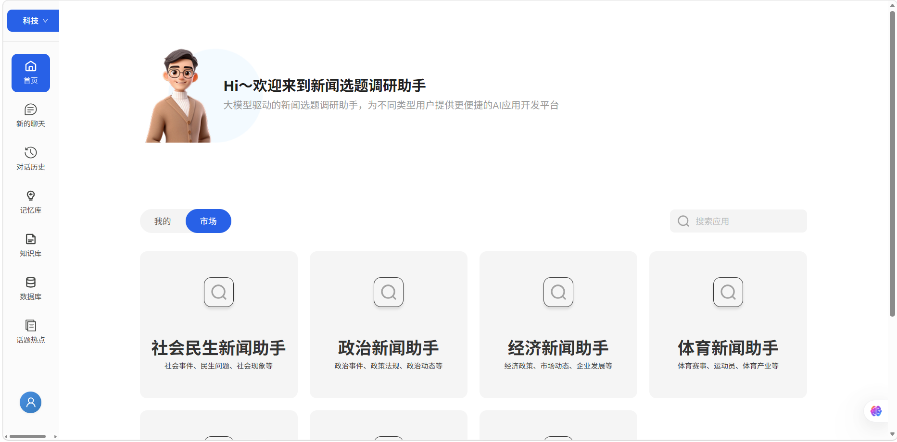

## 项目简介

新闻选题调研助手是为自媒体选题和内容创作场景做的一个项目。平时做热点解读、行业观察或者人物故事时，最花时间的往往不是写，而是前期找资料、理脉络、判断这个题值不值得做。这个项目就是想把这部分重复工作尽量收拢起来，让选题调研更快进入状态。

它的核心思路不是单纯“帮你搜答案”，而是把一个题目拆成可继续追踪的研究过程。输入一个议题后，系统会自动整理检索结果、提取关键信息、生成知识图谱和可视化分析，再输出一版可继续加工的调研报告。同时，它也支持热点采集和个人知识库上传解析，既能帮我盯住外部信息流，也能把自己平时积累的资料重新利用起来。对个人创作者来说，这样做的好处很直接：少在信息流里来回切换，多把时间用在判断观点和组织表达上。

## 项目定位

这个项目更偏向内容创作者自己的“选题研究台”，适合用来处理那些需要先做功课、再下笔的内容。它不追求大而全，更像一个围绕热点和选题调研搭起来的工作面板，重点解决“从想到一个题，到把资料摸清楚”这一步。

我目前把它理解成一个服务自媒体创作流程的小工具，比较适合下面这些场景：

- 热点事件快速研判
- 专题报道前期资料梳理
- 行业长期议题跟踪
- 复杂公共事件脉络分析
- 数据驱动型报道辅助写作
- 个人资料库整理与二次调用

## 功能亮点

### 1. 多领域选题入口

平台按照社会民生、政治、经济、体育、文化、娱乐、科技等不同新闻方向进行分类，便于用户快速进入目标赛道，提升选题检索与研究效率。

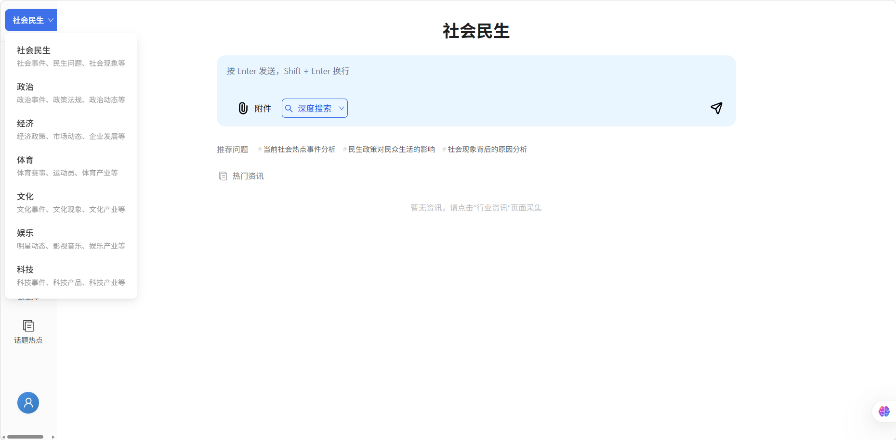

### 2. 双模式搜索

项目提供双模式搜索，支持在发起问题时灵活选择“深度搜索（网络）”和“本地知识库”两种来源。前者适合快速补充外部信息、追踪最新热点，后者适合调用自己上传整理过的资料、笔记和历史素材。两种模式可以按场景切换，也可以组合使用，让搜索结果既有外部信息增量，也能带上个人资料积累。

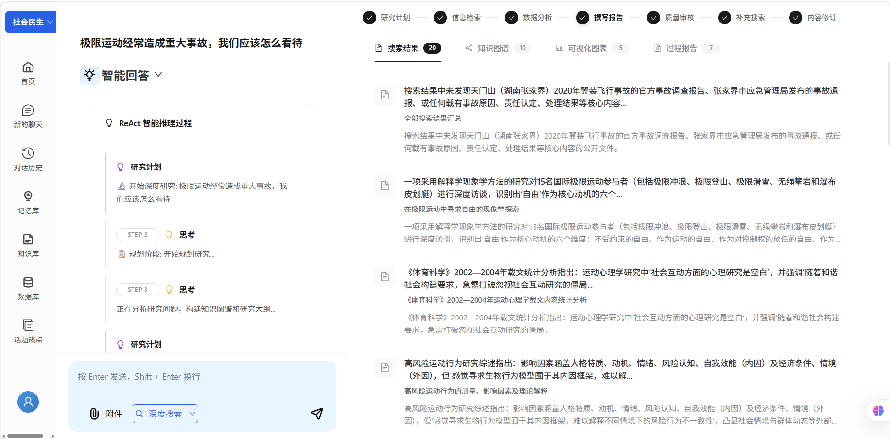
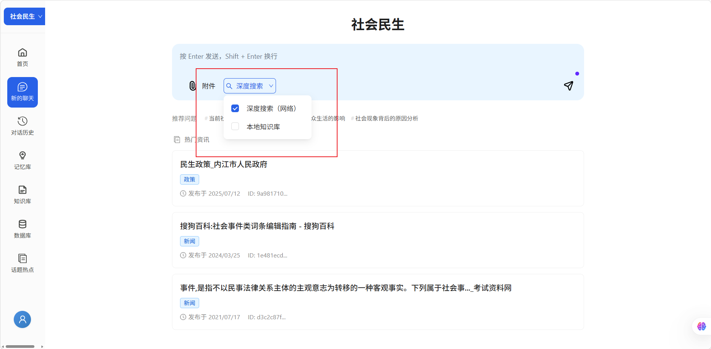

### 3. 热点采集与选题发现

除了手动输入议题，项目也支持热点采集能力，用来汇总当前值得关注的事件和话题线索。对自媒体创作来说，这一步可以减少反复刷平台、手动记选题的时间，更适合用来做每日选题池、热点观察和后续跟踪。

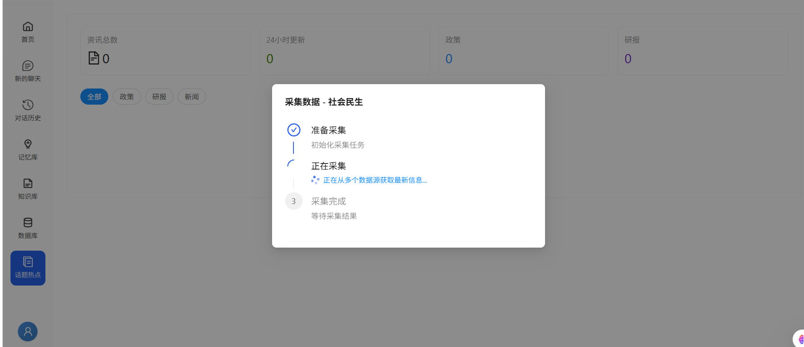

### 4. 个人知识库上传解析

项目支持上传个人资料并做解析，比如过往整理的文档、报道素材、行业笔记或阶段性研究内容。上传后，系统会把这些内容纳入后续检索和分析流程里，让已有积累不再只是“存着”，而是能在新选题里被重新调用。

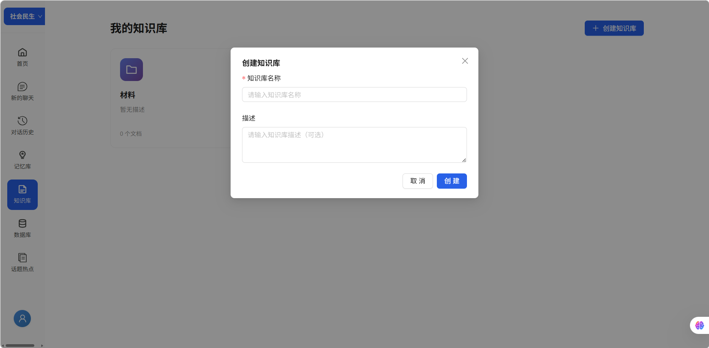

### 5. 可追踪的智能推理过程

系统左侧展示 ReAct 风格的推理与执行过程，将“研究计划”“思考”“行动”“观察”等步骤清晰呈现，让用户不仅看到结果，也能理解研究是如何展开的。

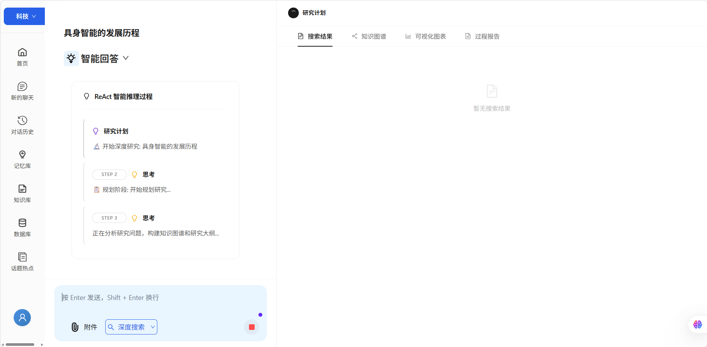
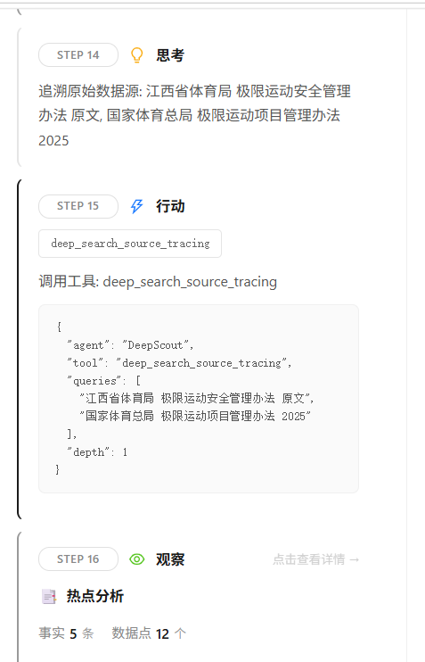

### 6. 结构化知识图谱

围绕议题中的核心事件、政策、企业、人物等要素，系统自动构建知识图谱，帮助用户快速识别议题关联网络，厘清事件背后的多方关系与传播链路。

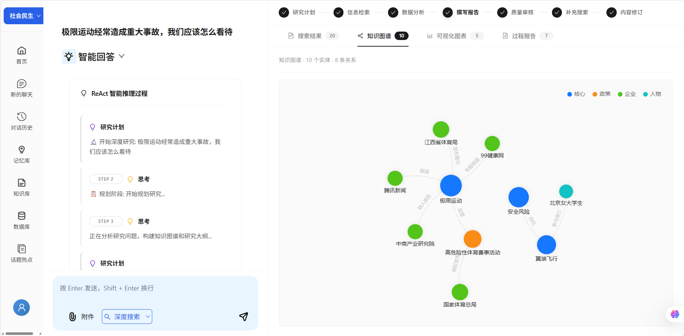

### 7. 数据图表与热点洞察

平台支持生成趋势图、对比图等可视化分析结果，用更直观的方式呈现传播热度、事件变化、风险分布等信息，为新闻判断提供数据支撑。

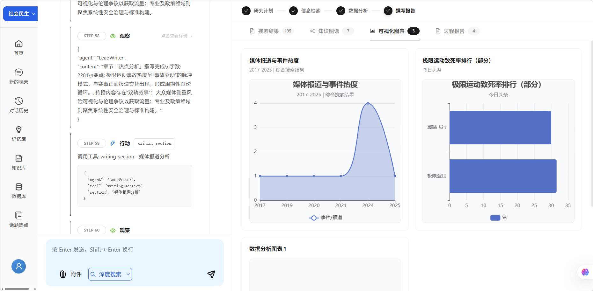

### 8. 自动生成调研报告

在完成检索与分析后，系统能够进一步输出结构清晰的最终报告，包括热点分析、传播趋势、议题分化、补充检索与内容修订等内容，帮助用户快速形成可用稿件基础。

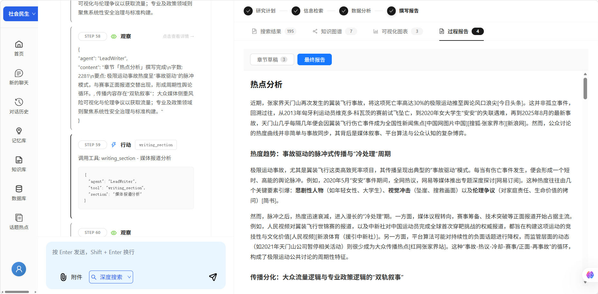

## 核心流程

整个项目围绕新闻研究的真实工作流展开，形成了完整闭环：

1. 用户通过热点采集或手动输入确定选题方向
2. 按需上传个人资料，补充自己的知识库内容
3. 系统生成研究计划，拆解问题
4. 自动进行信息检索与资料汇总
5. 构建知识图谱，梳理关键实体关系
6. 输出可视化图表，辅助洞察判断
7. 生成阶段性结果与最终调研报告
8. 支持后续补充检索、审校与内容修订

## 项目价值

对于新闻生产流程而言，本项目的价值不仅在于“更快找到资料”，更在于“更系统地理解问题”。它能够帮助团队减少重复检索与低效整理，把更多时间投入到判断、采访、写作与编辑决策中。

从业务角度看，新闻选题调研助手具备以下优势：

- 提升选题研判速度，缩短前期准备时间
- 加强资料整理的结构化与可追溯性
- 让复杂议题分析更直观、更完整
- 为深度报道、专题策划提供稳定支撑
- 推动新闻生产向智能化、协同化升级

## 总结

新闻选题调研助手是一套面向内容生产场景的智能研究系统。它将大模型能力与新闻业务流程深度结合，让选题研究不再停留在“搜一搜、看一看”的浅层阶段，而是升级为可规划、可分析、可追踪、可输出的完整工作流。

